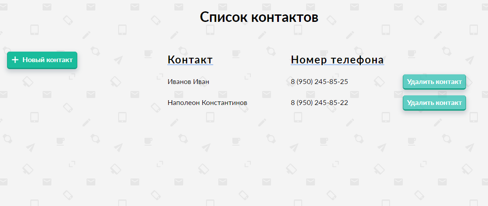

<h1>SPA приложение - Книга контактов</h1>

<h2>Страница 1 - Список контактов</h2>
<h2>Страница 2 - Контактная информация выбранного контакта</h2>

<h3>Функциональные требования для страницы 1</h3>

- Добавление контакта

- Удаление контакта (с подтверждением)

- Переход на контактную информацию контакта

<h3>Функциональные требования для страницы 2</h3>

  - Добавление полей в виде - "название : значение" (прим. E-mail:test@test.com)

- Удаление полей (с подтверждением)

- Редактирование полей с возможностью отмены (отмена с подтвердением)

- Отмена последнего внесенного изменения "Шаг назад"

